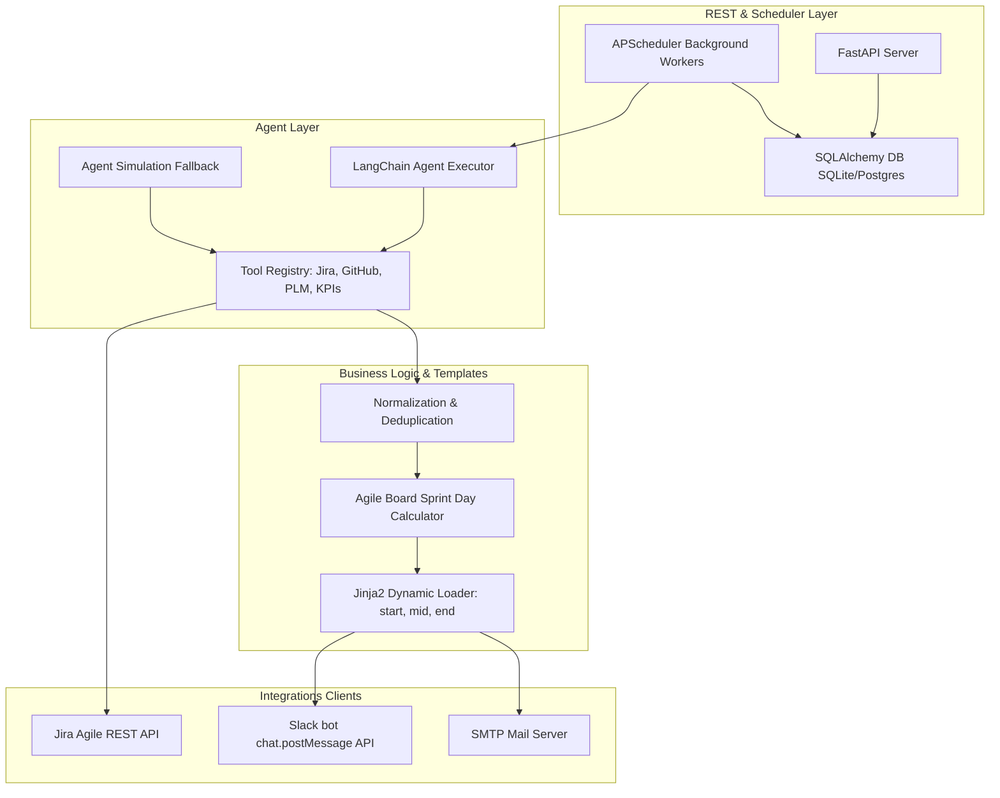

# System Architecture & Use Case Walkthrough

This document outlines the detailed system design, integration models, and execution flow of the AI-driven Reminder Agent System.

---

## 🏗️ System Architecture & Data Flow

The architecture is divided into three primary layers: the **REST Backend & Scheduler Layer**, the **Agent & Tool Orchestration Layer**, and the **Delivery & Integrations Client Layer**.



### 1. Sprint Day Calculation State Engine
The agent dynamically calculates the sprint stage using the active sprint dates retrieved from the Jira Board API:
- **`start`**: Active sprint is on Day 1 (where `today.date() <= startDate.date()`).
- **`end`**: Active sprint is on its final day (where `today.date() >= endDate.date()`).
- **`mid`**: Active sprint is in progress (between start and end dates).
  - **Near End Flag**: Evaluated if `days_left <= 3` to raise spillover alerts for unstarted tasks.

### 2. File-Based Maintainability
- **Prompts**: Externalized to `backend/app/agent/prompts/system_prompt.txt` and `user_prompt.txt`.
- **Jinja2 Templates**: Externalized to separate files in `backend/app/templates/` (`sprint_start.jinja2`, `sprint_mid_consolidated.jinja2`, `sprint_closure.jinja2`, `plm_tat_breach.jinja2`).

---

## 🧪 Test Scenarios & Use Cases

You can test all configurations locally using the `test_agent_flow.py` script. The mock database (`app/mock_data.py`) contains specific profiles to validate each scenario:

### Case 1: Sprint Start Day alerts (Day 1)
- **Execution Command**:
  ```bash
  python backend/test_agent_flow.py --all --sprint-day start
  ```
- **Expected Outputs**:
  - **`alice` / `bob` / `arunj` / `charlie`**: Receives a list of their sprint tasks and a summary of their sprint plan.
  - **`alice`**: Receives an additional warning block: *`ABC-123 & ABC-456 are missing subtasks. Please create subtasks today.`* (Alice has tasks in progress but no subtasks).
  - **`david`**: Receives a warning block: *`You do not have any tasks or stories assigned to you. Please create stories...`* (David has zero tickets in the active sprint).

### Case 2: Sprint Mid Day alerts
- **Execution Command**:
  ```bash
  python backend/test_agent_flow.py --all --sprint-day mid
  ```
- **Expected Outputs**:
  - **`alice`**: Receives a warning under **`🔴 Tasks Missing Subtasks`** because her active tickets (`ABC-123` & `ABC-456`) lack subtask structures.
  - **`bob`**: Receives a warning under **`🟡 Tasks Not in Progress`** because his tasks (`XYZ-789`) have subtasks but none have been moved to `In Progress` status.
  - **`arunj`**: Receives a warning under **`🟠 Tasks with Missing Effort Logs`** because his task `ABC-222` is `In Progress` but has `timespent == 0` and empty worklogs.
  - **`charlie`**: Receives a **`🎉 Appreciation`** block: *`Excellent Work! You have subtasks, active progress, and logged efforts...`* (Charlie has subtasks, active progress, and logged efforts today).
  - **`david`**: Receives the backlog warning requesting task creations.

### Case 3: Sprint Near-End alerts (Closure approaching)
- **Execution Command**:
  ```bash
  python backend/test_agent_flow.py --all --sprint-day near_end
  ```
- **Expected Outputs**:
  - All mid-day checks run.
  - **`bob`**: Receives a warning under **`⚠️ Sprint Closure Approaching`** listing his unstarted tasks (`XYZ-789` is still in `To Do` status with only 2 days left in the sprint) advising him to start or carry them forward.

### Case 4: Sprint Closure Day alerts (Last Day)
- **Execution Command**:
  ```bash
  python backend/test_agent_flow.py --all --sprint-day end
  ```
- **Expected Outputs**:
  - **All Users**: Reminded to close active tasks, move completed items to `Done`, and log remaining efforts.
  - **`bob` / `arunj` / `charlie` / `alice`**: Receives a list under **`⌛ Unfinished & Stale Items`** showing incomplete tasks that will carry forward, advising them to move those items to the next sprint or Product Backlog.

---

## 🛠️ Testing Real Integrations

Rename `backend/.env.example` to `backend/.env` and fill in your connection details:
- Run `python backend/run.py` to start the backend.
- Create or update the config named `Active Sprint Board Reminders` with your Jira Board ID.
- Enable the alert day options (Start, Mid, End) and target channels.
- Click **Trigger Agent** in the UI dashboard or run `python backend/test_agent_flow.py --real` to test the full agentic vLLM query cycle and deliver real messages.
